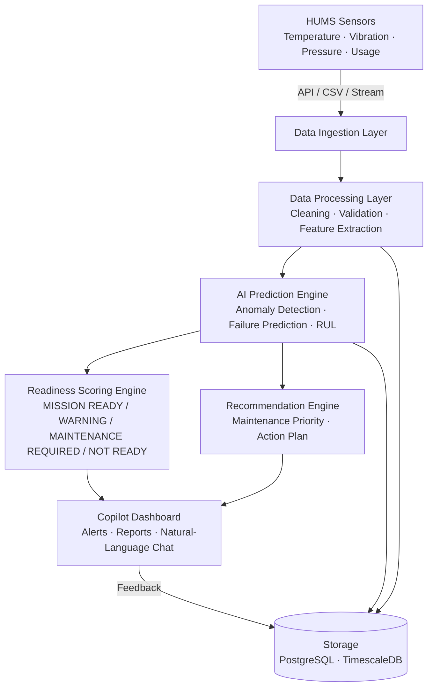

# Architecture

## System Architecture

The Mission Readiness & Predictive Maintenance Copilot is structured as a layered pipeline — from raw sensor ingestion through AI prediction to the operator dashboard.

## Components

| Component | Technology | Responsibility |
|---|---|---|
| Frontend | React / Next.js + Tailwind CSS + Chart.js | Fleet dashboard, equipment health pages, alert screens, Copilot chat interface |
| Backend API | Python FastAPI | REST endpoints, business logic, WebSocket live alerts, orchestration |
| AI / ML Engine | Python · Scikit-learn · XGBoost · Pandas | Anomaly detection, failure prediction, remaining useful life estimation, readiness scoring |
| Recommendation Engine | Python | Prioritises maintenance tasks, generates action plans and explanations |
| Structured Storage | PostgreSQL | Equipment records, maintenance tasks, predictions, audit trail |
| Time-Series Storage | TimescaleDB / InfluxDB | Sensor readings with high-frequency timestamps |
| Object Storage | Cloud / On-premise | Raw data files, exported maintenance reports |

## Data Flow

1. HUMS sensors and maintenance systems produce readings and service records.
2. The ingestion layer receives data via REST API, CSV upload, or streaming; validates, timestamps, and stores raw records.
3. The processing layer removes invalid values, normalises readings, fills gaps, and extracts features (average temperature, vibration trend, pressure deviation, usage hours, time since last service, failure frequency).
4. The AI prediction engine runs anomaly detection (Isolation Forest / Autoencoder) and failure-probability models (Random Forest / XGBoost), outputting risk level, confidence score, and predicted failure date.
5. The readiness scoring engine combines prediction output with maintenance history and mission requirements to assign one of four readiness levels.
6. The recommendation engine ranks maintenance tasks by urgency (Critical / High / Medium / Low) and produces an actionable maintenance plan.
7. Alerts, readiness status, and recommendations are surfaced on the Copilot dashboard in real time.
8. Maintenance personnel act on recommendations; completed records are stored and used for future model improvement.

## API Endpoints

| Method | Endpoint | Purpose |
|---|---|---|
| POST | `/api/sensors/data` | Ingest sensor readings |
| GET | `/api/equipment` | List all equipment |
| GET | `/api/equipment/{id}/health` | Current health status for one asset |
| GET | `/api/equipment/{id}/readiness` | Readiness classification for one asset |
| GET | `/api/alerts` | Active alerts across the fleet |
| GET | `/api/maintenance/recommendations` | Prioritised maintenance task list |
| POST | `/api/maintenance/feedback` | Submit completed-maintenance feedback |
| POST | `/api/copilot/query` | Natural-language Copilot question |
| GET | `/api/reports/readiness` | Fleet-wide readiness report |

## Security Considerations

- Authentication and role-based access control on all API routes.
- Data encrypted in transit (TLS) and at rest.
- Audit log maintained for all AI recommendations and decisions.
- All sensor inputs validated before processing.
- Human approval required before executing critical maintenance actions.
- AI predictions include confidence score and plain-language explanation.
- Fallback rule-based logic activates when AI predictions are unavailable.
- Demo/simulation data strictly separated from operational data.

## Scalability Notes

The FastAPI backend is stateless and can be horizontally scaled behind a load balancer. Sensor ingestion can be decoupled into an async queue (e.g. Kafka or Redis Streams) to handle burst traffic. TimescaleDB provides native time-series partitioning for high-frequency sensor data. ML models are packaged as independent inference services and can be updated or swapped without redeploying the rest of the stack. The Docker-based deployment supports both cloud and on-premise environments.
