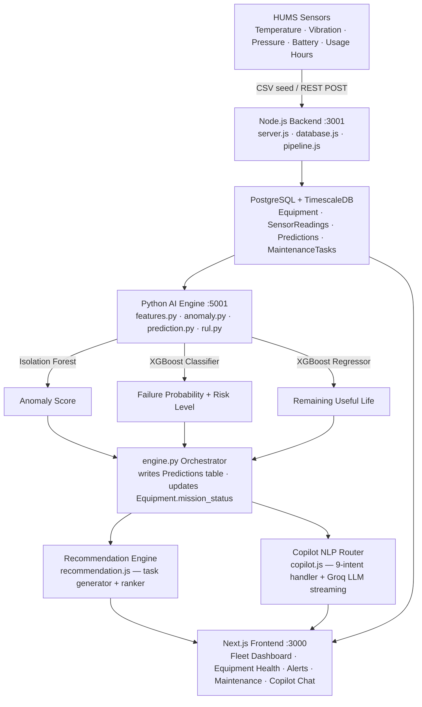

# Architecture

## System Architecture

The Mission Readiness & Predictive Maintenance Copilot is structured as a three-service pipeline — Node.js/Express backend, Python AI engine, and a Next.js frontend — all backed by PostgreSQL with TimescaleDB.



## Services Overview

| Service | Technology | Port | Entry Point |
|---|---|---|---|
| Backend API | Node.js 18 + Express | 3001 | `src/backend-node/server.js` |
| AI Engine | Python 3.11 + XGBoost + Scikit-learn | 5001 | `src/backend-node/ai/server.py` |
| Frontend | Next.js 14 + Tailwind CSS | 3000 | `src/frontend/` |
| Database | PostgreSQL 14 + TimescaleDB | 5432 | `src/backend-node/database.js` |

## Components

| Component | File(s) | Responsibility |
|---|---|---|
| Express API | `server.js` | All REST endpoints, request validation, readiness scoring, orchestration calls to AI engine |
| DB Schema | `database.js` | Creates Equipment, SensorReadings (hypertable), Predictions, MaintenanceTasks tables |
| CSV Seeder | `pipeline.js` | Idempotent loader of `equipment_data.csv` — 12 real equipment records |
| AI Feature Extractor | `ai/features.py` | Queries PostgreSQL for latest sensor readings and computes feature vector per asset |
| Anomaly Detector | `ai/anomaly.py` | Isolation Forest — flags sensor profiles that deviate from fleet baseline |
| Failure Predictor | `ai/prediction.py` | XGBoost binary classifier — outputs failure probability + risk level (Critical/High/Medium/Low) |
| RUL Estimator | `ai/rul.py` | XGBoost regressor — outputs remaining useful life in days |
| Explanation Generator | `ai/explanation.py` | Converts numeric risk scores into plain-English sentences for operators |
| AI Orchestrator | `ai/engine.py` | Runs full pipeline per asset, writes result to Predictions table, updates Equipment.mission_status |
| AI HTTP Server | `ai/server.py` | Exposes `POST /predict` (single asset) and `POST /predict/fleet` (all assets) on port 5001 |
| Model Trainer | `ai/train.py` | Trains XGBoost failure + RUL models on `equipment_data.csv` with physics-based degradation augmentation |
| Copilot Router | `copilot.js` | 9-intent NLP handler — routes natural-language queries to DB-driven answer functions |
| Recommendation Engine | `recommendation.js` | Generates and ranks maintenance tasks from AI predictions (Critical → High → Medium → Low) |
| Frontend | `src/frontend/` | Next.js App Router — fleet dashboard, equipment health, alerts, maintenance, Copilot chat |

## Data Flow

1. **Seeding**: `pipeline.js` loads `equipment_data.csv` (12 assets with temperature, vibration, pressure, battery, usage hours) into `Equipment` and `SensorReadings` tables on startup.
2. **Sensor Ingest**: New readings arrive via `POST /api/sensors/ingest`; validated and inserted into the `SensorReadings` TimescaleDB hypertable.
3. **Prediction Run**: `POST /api/predictions/run` (single) or `/api/predictions/run/fleet` (all) calls the Python AI engine at `:5001`.
4. **AI Pipeline**: `features.py` fetches latest readings → `anomaly.py` computes anomaly score → `prediction.py` outputs failure probability → `rul.py` outputs RUL days → `explanation.py` builds plain-English text → `engine.py` writes a row to `Predictions` and updates `Equipment.mission_status`.
5. **Recommendations**: `POST /api/maintenance/plan` calls `recommendation.js` which reads the latest `Predictions` and returns a ranked task list.
6. **Copilot**: `POST /api/copilot/query` routes to `copilot.js` (9 intents — fleet status, equipment health, failure risk, maintenance, alerts, RUL, anomalies, readiness check, mission status). For free-form queries, the frontend streams via Groq `llama-3.3-70b-versatile`.
7. **Dashboard**: The Next.js frontend calls the Node.js API and renders fleet readiness, sensor trend charts, active alerts, maintenance task list, and Copilot chat.

## API Endpoints (Node.js Backend — port 3001)

| Method | Endpoint | Purpose |
|---|---|---|
| GET | `/api/equipment` | List all equipment with latest readiness status |
| GET | `/api/equipment/:id` | Single asset detail |
| GET | `/api/equipment/:id/health` | Latest sensor readings + computed health score |
| GET | `/api/equipment/:id/readiness` | Current readiness classification for one asset |
| POST | `/api/sensors/ingest` | Ingest new sensor reading |
| GET | `/api/alerts` | Active alerts across the fleet |
| GET | `/api/maintenance/recommendations` | Prioritised maintenance task list |
| POST | `/api/maintenance/plan` | Generate + rank maintenance plan (calls recommendation.js) |
| POST | `/api/predictions/run` | Run AI prediction for one asset (calls Python engine) |
| POST | `/api/predictions/run/fleet` | Run AI predictions for entire fleet |
| POST | `/api/copilot/query` | Natural-language Copilot question (9-intent NLP router) |

## AI Engine Endpoints (Python — port 5001)

| Method | Endpoint | Purpose |
|---|---|---|
| POST | `/predict` | Run full AI pipeline for one equipment ID |
| POST | `/predict/fleet` | Run full AI pipeline for all active equipment |

## Database Schema

### Equipment
```
equipment_id (PK)  equipment_type  model  unit
mission_status     last_service_date      total_usage_hours
```

### SensorReadings (TimescaleDB hypertable on `timestamp`)
```
id (PK)  equipment_id (FK)  timestamp
temperature  vibration  pressure  battery
```

### Predictions
```
id (PK)  equipment_id (FK)  timestamp
anomaly_score  failure_probability  risk_level
rul_days  explanation  model_version
```

### MaintenanceTasks
```
id (PK)  equipment_id (FK)
task_type  priority  recommended_action
estimated_downtime_hours  status  created_at
```

## Security Considerations

- All sensor inputs validated before insertion (range checks, type checks in `server.js`).
- AI predictions include confidence score and plain-language explanation.
- Fallback rule-based readiness scoring (`computeReadiness()` in `server.js`) activates when the AI engine is unavailable.
- Demo/CSV data is strictly separated from any real operational data.
- Human approval is expected before executing critical maintenance actions — the system only recommends, not executes.

## Scalability Notes

The Node.js backend is stateless and can be horizontally scaled behind a load balancer. The Python AI engine is a separate HTTP service and can be scaled independently or replaced with a containerised inference endpoint. TimescaleDB provides native time-series partitioning for high-frequency sensor data. XGBoost models are saved as JSON artefacts (`failure_model.json`, `rul_model.json`) and can be updated without redeploying the rest of the stack.
