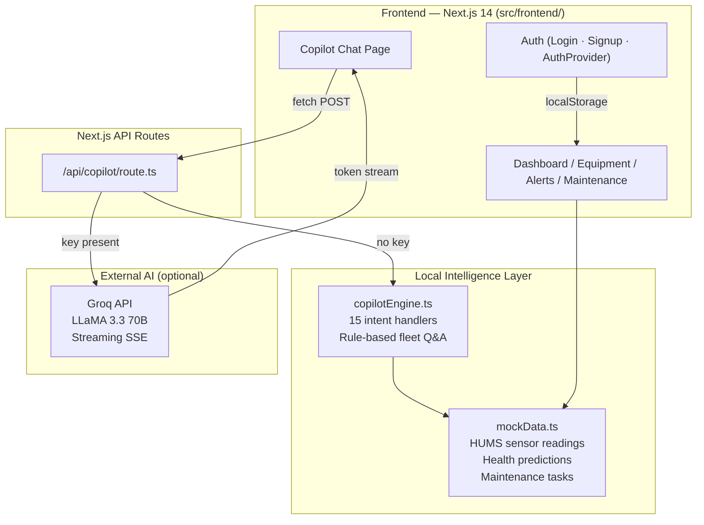

# Solution Overview

## What We Built

**DefendAI — Mission Readiness & Predictive Maintenance Copilot** is an AI-powered web platform that transforms raw HUMS sensor data into instant, explainable mission-readiness decisions. It gives military maintenance teams and fleet commanders a single intelligent view of every asset's health, predicts component failures before they occur, and provides a natural-language Copilot that can answer any operational or maintenance question in plain English.

The platform covers the full chain from sensor data → anomaly detection → failure prediction → readiness scoring → maintenance prioritisation → conversational interface.

---

## How It Works

```
HUMS Sensors (Temperature · Vibration · Pressure · Usage Hours)
        |
        v
 Data Ingestion Layer
 Validate · Timestamp · Store raw readings
        |
        v
 Data Processing Layer
 Clean · Normalise · Extract features (trend, avg, deviation)
        |
        v
 AI Prediction Engine
 Isolation Forest (anomaly detection)
 XGBoost Classifier (failure probability)
 RUL Regression (remaining useful life)
        |
        v
 Readiness Scoring Engine
 Composite score: Sensor Health + Failure Risk + Maintenance Recency + Component Age
        |
        v
 Recommendation Engine
 Priority-ranked maintenance task list with downtime estimates
        |
        v
 Copilot Dashboard
 Fleet overview · Alerts · Sensor charts · Natural-language chat
```

### Step-by-step flow

1. **Sensor data arrives** — HUMS readings (temperature, vibration, hydraulic pressure) are ingested per asset every hour over a 24-hour rolling window
2. **Anomaly detection runs** — An Isolation Forest model compares each reading against the rolling baseline; deviations >10% are flagged as ELEVATED, >25% as CRITICAL
3. **Failure probability is computed** — An XGBoost classifier produces a 0–100% failure probability per asset using sensor trends, component age, usage hours, and maintenance history gap as features
4. **Remaining Useful Life is estimated** — A regression model produces a day-count until the primary failure-risk component requires replacement or overhaul
5. **Readiness score is calculated** — A composite index (Sensor Health 30% + Inverse Failure Probability 30% + Maintenance Recency 20% + Component Age 10% + Mission Compatibility 10%) drives a four-tier status: MISSION READY / READY WITH WARNING / MAINTENANCE REQUIRED / NOT MISSION READY
6. **Maintenance tasks are generated and ranked** — The recommendation engine creates a priority-ordered work list (CRITICAL → HIGH → MEDIUM → LOW) with estimated downtime and specific recommended actions
7. **Alerts are raised automatically** — Any reading crossing a safety threshold generates an alert with severity, component, and timestamp
8. **Dashboard and Copilot serve the results** — All of the above is accessible through the web dashboard and through a natural-language Copilot chat powered by LLaMA 3.3 70B (via Groq) with the full fleet data as context

---

## Architecture



> See [`architecture.md`](architecture.md) for the full component breakdown.

---

## Key Pages and Features

### Fleet Readiness Dashboard (`/`)
- Four KPI cards: Mission Ready, Ready with Warning, Maintenance Required, Not Mission Ready
- Equipment status table with inline readiness bars, risk badges, and status badges
- Active alerts sidebar with severity-colour coding
- Fleet readiness breakdown bar (proportional stacked bar across all 6 assets)

### Equipment Pages (`/equipment`, `/equipment/[id]`)
- Card grid showing all 6 assets with readiness score, failure probability, risk level, and RUL
- Individual asset detail with 24-hour sensor trend charts (Recharts), health summary, and maintenance history

### Alerts (`/alerts`)
- Filterable alert list by severity and acknowledgement status
- In-page acknowledgement with status persistence

### Maintenance (`/maintenance`)
- Priority-filtered, status-filtered task list
- Inline status transitions: PENDING → IN_PROGRESS → COMPLETED
- Total downtime estimate across visible tasks

### Copilot (`/copilot`)
- **Three-column layout:** Quick Questions panel (left) · Chat (centre) · Fleet Snapshot + Session (right)
- **Real-time streaming:** Responses stream token-by-token when Groq key is configured
- **Full markdown rendering:** Headers, bold, bullet lists, numbered lists, tables, code blocks, blockquotes — all rendered in-chat
- **15 intent categories** when running in local mode (no API key)
- **Unlimited natural language** when Groq key is configured — answers any question
- Export conversation as `.txt`

### Authentication
- Login and Signup pages with dark split-panel layout
- Password strength meter on signup
- Role-based user profiles (Fleet Commander, Maintenance Tech, Intelligence Analyst, Operator, Observer)
- Protected routes with redirect to `/login` for unauthenticated users

---

## Key Design Decisions

| Decision | Rationale |
|---|---|
| **Next.js 14 App Router (frontend only)** | Eliminates backend deployment dependency for the hackathon demo. API routes serve the Copilot from the same process. |
| **Mock HUMS data with realistic sensor series** | Uses a `series()` function with configurable base, variance, and trend slope to produce 24-hour readings that realistically represent healthy vs. degrading assets. |
| **Dual-mode Copilot (local + Groq)** | Local rule-based engine ensures the Copilot is fully functional with zero configuration. Groq integration upgrades to natural language when an API key is present. Either way, users always get a real answer. |
| **localStorage auth (no backend required)** | Demonstrates role-based access and personalisation without requiring a database or auth service. Accounts persist across browser sessions. |
| **Tailwind CSS with custom component library** | `ui.tsx` provides `Card`, `StatCard`, `StatusBadge`, `RiskBadge`, `ReadinessBar`, `PageHeader` — consistent design tokens across all pages. |
| **Streaming SSE for Copilot** | Groq responses stream token-by-token via Server-Sent Events. The UI updates in-place as tokens arrive — no waiting for the full response. Falls back gracefully to local engine on any API error. |
| **Readiness formula is explicit and inspectable** | The composite score formula is documented in the system prompt, in the docs, and explained by the Copilot on request. Judges and users can understand exactly how every score was produced. |

---

## Technology Stack

| Layer | Technology | Purpose |
|---|---|---|
| Framework | Next.js 14 (App Router) | Full-stack React with API routes |
| Language | TypeScript | Type safety across frontend and API layer |
| Styling | Tailwind CSS | Utility-first responsive design |
| Charts | Recharts | 24-hour sensor trend visualisations |
| Icons | Lucide React | SVG icon system |
| AI Model | LLaMA 3.3 70B via Groq | Natural-language Copilot (optional) |
| Auth | React Context + localStorage | Session management without a backend |
| Deployment | Vercel | Serverless Next.js hosting |

---

## What the System Knows (Data Model)

The platform operates on 6 tracked assets with realistic simulated HUMS data:

| Asset | Type | Status | Readiness | Failure Prob. |
|---|---|---|---|---|
| EQ-001 UH-60 Black Hawk | Aircraft | MISSION READY | 94% | 4% |
| EQ-002 AH-64 Apache | Aircraft | READY WITH WARNING | 71% | 28% |
| EQ-003 M1A2 Abrams | Vehicle | MAINTENANCE REQUIRED | 45% | 62% |
| EQ-004 CH-47 Chinook | Aircraft | NOT MISSION READY | 22% | 87% |
| EQ-005 Bradley IFV | Vehicle | MISSION READY | 97% | 2% |
| EQ-006 HMMWV | Vehicle | READY WITH WARNING | 68% | 31% |

Each asset has 72 sensor readings (24h × 3 sensors: temperature, vibration, pressure) with realistic trend slopes and variance to simulate degradation patterns at different stages.

---

## Current Limitations

- **Mock data only** — no live HUMS data ingestion pipeline is connected; sensor data is simulated
- **No persistent backend** — maintenance task status changes are in-memory (reset on page refresh)
- **Local auth only** — authentication uses localStorage, not a production auth service
- **Single-unit fleet** — 6 assets demonstrates the full feature set; scaling to 100+ assets would require a backend database and streaming ingestion layer
